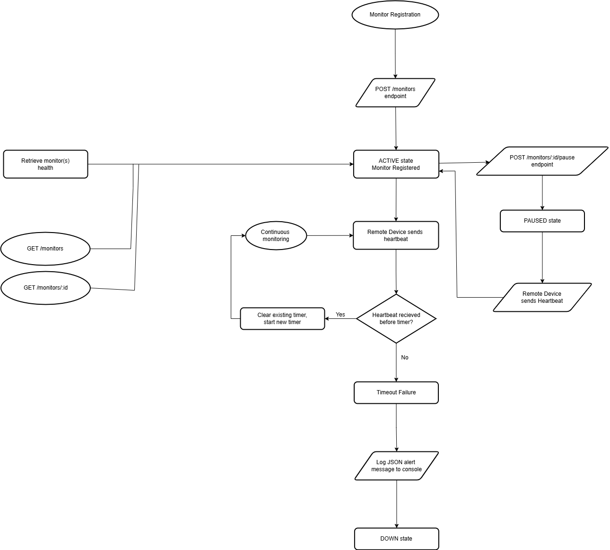

# Pulse-Check-API ("Watchdog Sentinel")

## 1. Project Title & Description

Pulse-Check-API is a backend monitoring service designed to track the health of remote devices using a heartbeat-based mechanism.

Each device is registered as a monitor with a defined timeout period. The system continuously expects heartbeat signals from the device. If no heartbeat is received within the configured timeout window, the device is marked as DOWN and an alert is triggered.

This simulates real-world monitoring systems used for infrastructure tracking in unstable or remote environments.

## 2. System Overview

The system is built around an in-memory, timer-based monitoring model.

A monitor is created using a unique device ID and a timeout value.
Once registered, a countdown timer begins immediately.
Each heartbeat request resets the timer and updates heartbeat timestamps.
If the timer expires without receiving a heartbeat:
The monitor status changes to DOWN
An alert is triggered via console logging
Monitors can be paused to temporarily stop tracking.
When a paused monitor receives a heartbeat, it automatically resumes and restarts monitoring.

This design uses Node.js setTimeout to simulate real-time failure detection.

## 3. Architecture Diagram

The system architecture is illustrated in the diagram below:

### System Summary

The system follows a state-based monitoring flow:

A device registers a monitor via POST /monitors
The server starts a countdown timer immediately
Heartbeats reset the timer and update timestamps
If no heartbeat is received before timeout, the monitor transitions to DOWN
A pause state temporarily stops monitoring
When paused, heartbeat can resume normal monitoring

## 4. API Documentation

### 1. Register Monitor

Endpoint:

POST /monitors

Purpose:
Create a new device monitor and start a countdown timer.

Request Body:

{
  "id": "device-1",
  "timeout": 30,
  "alert_email": "test@mail.com"
}

Response:

{
  "message": "Monitor registered successfully",
  "monitor": {
    "id": "device-1",
    "timeout": 30,
    "alert_email": "test@mail.com",
    "status": "active",
    "lastHeartbeatAt": 1710000000000
  }
}

### 2. Heartbeat

Endpoint:

POST /monitors/:id/heartbeat

Purpose:
Reset the monitor timer and update heartbeat timestamps.

Response:

{
  "message": "Heartbeat received, timer reset",
  "monitor": {
    "id": "device-1",
    "status": "active",
    "lastHeartbeatAt": 1710000001000,
    "previousHeartbeatAt": 1710000000000
  }
}

### 3. Pause Monitor

Endpoint:

POST /monitors/:id/pause

Purpose:
Temporarily stop monitoring a device.

Response:

{
  "message": "Monitor paused successfully",
  "monitor": {
    "id": "device-1",
    "status": "paused"
  }
}

### 4. Get All Monitors

Endpoint:

GET /monitors

Purpose:
Retrieve all registered monitors.

Response:

{
  "monitors": []
}
### 5. Get Single Monitor

Endpoint:

GET /monitors/:id

Purpose:
Retrieve details of a specific monitor.

Response:

{
  "monitor": {
    "id": "device-1",
    "status": "active",
    "timeout": 30
  }
}

## 5. Developer’s Choice Feature
Custom Observability Enhancement

In addition to the required functionality, I implemented observability-focused GET endpoints to improve system transparency and debugging capability.

Implemented Endpoints
GET /monitors
GET /monitors/:id
Purpose

These endpoints allow administrators to:

view all registered monitors in real time
inspect individual device states
monitor system health without triggering side effects
debug device behavior during runtime
Value Added

While the core system focuses on state transitions (ACTIVE, PAUSED, DOWN), these endpoints introduce a read-only observability layer that improves system usability.

This makes it easier to:

verify system state during testing
monitor device lifecycle progression
support debugging and operational visibility
Summary

This feature enhances the system by providing a clear, non-intrusive way to inspect monitor states, improving overall transparency and maintainability.

## 6. Setup Instructions
Clone Repository
git clone <https://github.com/NanaYawAustin/Pulse-Check-API.git>
cd Pulse-Check-API
Install Dependencies
npm install
Start Server
npm start
Base URL
http://localhost:3000

## 7. Final Checklist
Repository is public and accessible
Server runs successfully with npm start
All API endpoints tested and functional
Architecture diagram included in README
No node_modules or unnecessary files committed
README fully replaces original assignment instructions